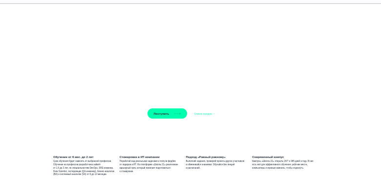
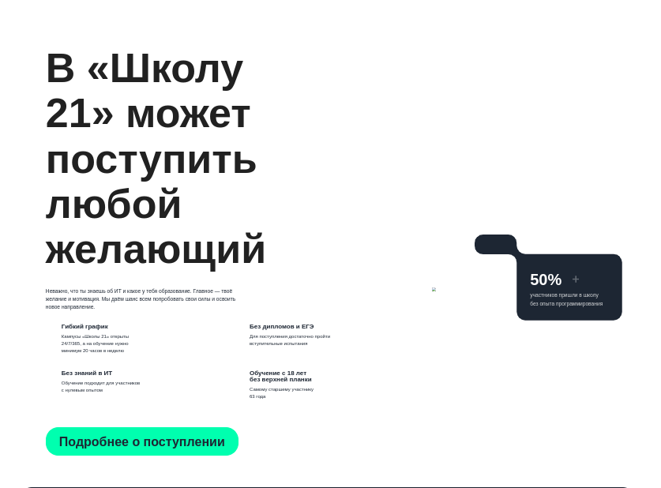
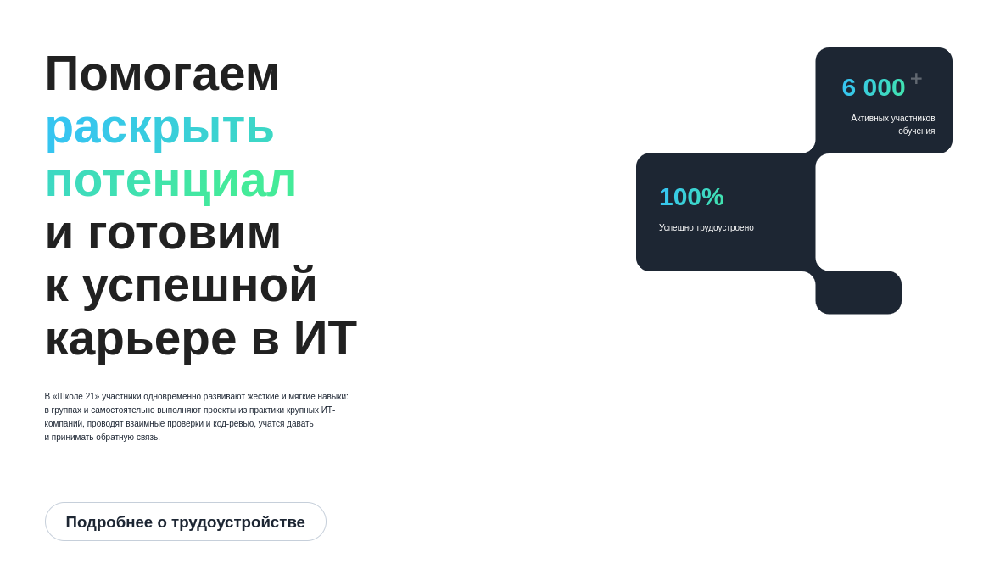

# Задание 6. Тестирование UI веб-сайта

## Описание
Выполнено сравнение локально запущенного сайта с макетом Figma: [Ссылка на макет](https://www.figma.com/design/eTKqLIoG72PDLMuLUM4g7n/%D0%A1%D0%B1%D0%B5%D1%8021?node-id=0-1&p=f)

Найдены следующие несоответствия:

---

## 🐞 Багрепорты

### 1️⃣ Нет рисунка за кнопкой «Поступить»
**Шаги воспроизведения:**
1. Открыть главную страницу сайта.
2. Найти секцию с кнопкой «Поступить».

**Ожидаемый результат:**  
Фоновый рисунок за кнопкой совпадает с макетом.

**Фактический результат:**  
Фоновый рисунок отсутствует.

**Приоритет:** Средний

**Скриншот:** 

---

### 2️⃣ Заголовок «В Школу 21 может поступить любой желающий» слишком крупный
**Шаги воспроизведения:**
1. Найти блок «В Школу 21 может поступить любой желающий».

**Ожидаемый результат:**  
Размер шрифта соответствует макету.

**Фактический результат:**  
Шрифт больше, чем в макете.

**Приоритет:** Средний

**Скриншот:** 

---

### 3️⃣ Отступы в блоке «Помогаем раскрыть потенциал…» не совпадают
**Шаги воспроизведения:**
1. Перейти к блоку «Помогаем раскрыть потенциал и готовим к успешной карьере в ИТ».

**Ожидаемый результат:**  
Отступы сверху и снизу соответствуют макету.

**Фактический результат:**  
Отступы отличаются от макета.

**Приоритет:** Низкий

**Скриншот:** 

---

